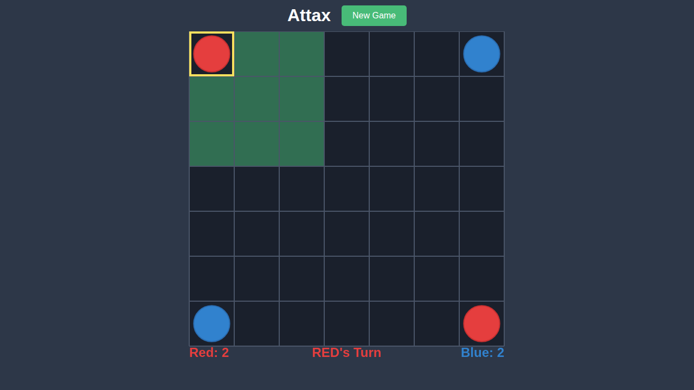
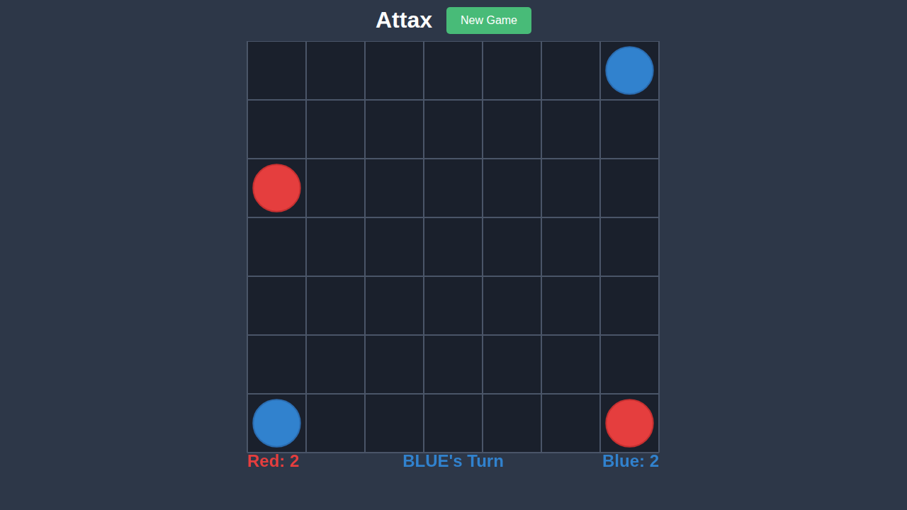

# Test 003: Jump Move

## Overview

This test validates the jump move mechanics in Attax. A jump move occurs when a piece moves exactly 2 cells in any direction (including diagonals). Unlike a clone move, the original piece is removed and only exists at the new destination.

## What This Test Validates

- Piece selection shows valid moves including 2-cell destinations
- Clicking a cell 2 squares away triggers a jump move
- After jump: original piece disappears, piece appears at destination
- Score remains the same (piece count unchanged for jumping player)

## Test Scenario

1. Red selects piece at position (0,0) - top-left corner
2. Valid moves are highlighted (all empty cells within 2 squares)
3. Red clicks on position (2,0) to jump 2 cells down
4. Piece jumps - original at (0,0) disappears, appears at (2,0)
5. Score remains: Red 2, Blue 2 (no conversion, just relocation)

## Significant Moments

### 0000 - Before Jump

Initial game state before any move is made.


**Expected State:**
- Standard initial board setup
- Red: 2, Blue: 2
- RED's Turn

### 0001 - Piece Selected for Jump

Red player has selected the piece at (0,0). Valid moves include 2-cell destinations.



**Expected State:**
- Yellow highlight around selected piece at (0,0)
- Green highlights showing valid move destinations
- Destinations include cells at distance 2 (jump targets)

### 0002 - After Jump

After the jump move to (2,0). The original piece is gone and the piece is at the new location.



**Expected State:**
- No piece at (0,0) - original piece moved
- Red piece at (2,0) - jumped piece
- Score: Red 2, Blue 2 (unchanged, just relocated)
- BLUE's Turn (turn switched to opponent)

## Clone vs Jump

| Move Type | Distance | Original Piece | Result |
|-----------|----------|----------------|--------|
| Clone | 1 cell | Stays | Piece duplicated |
| Jump | 2 cells | Removed | Piece relocated |

## Running This Test

```bash
npx playwright test e2e/003-jump-move
```

To update screenshots:
```bash
npx playwright test e2e/003-jump-move --update-snapshots
```
