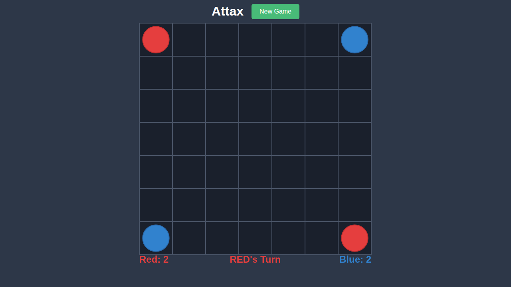
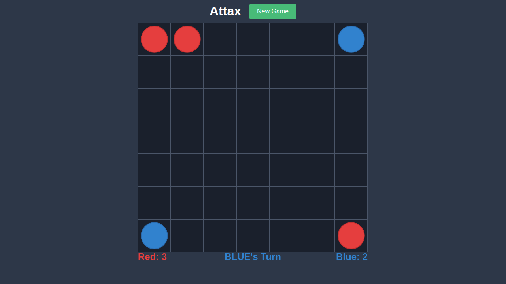
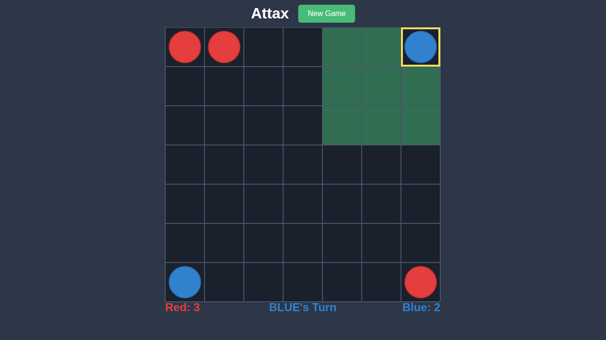
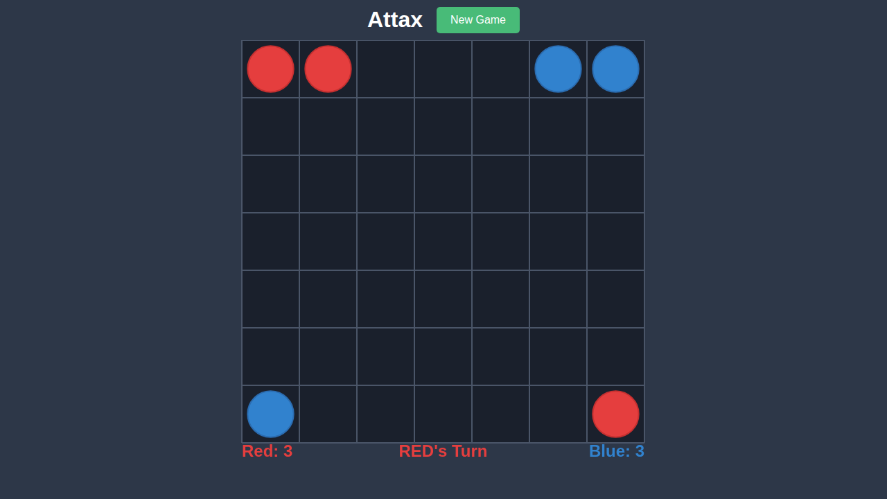
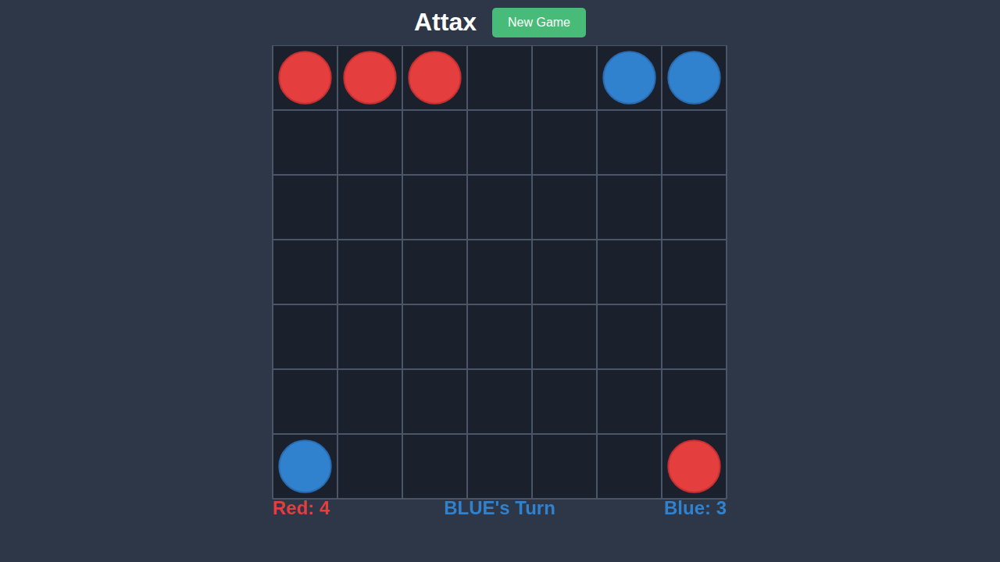
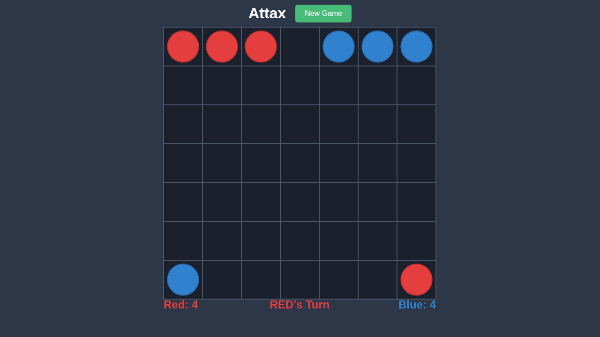
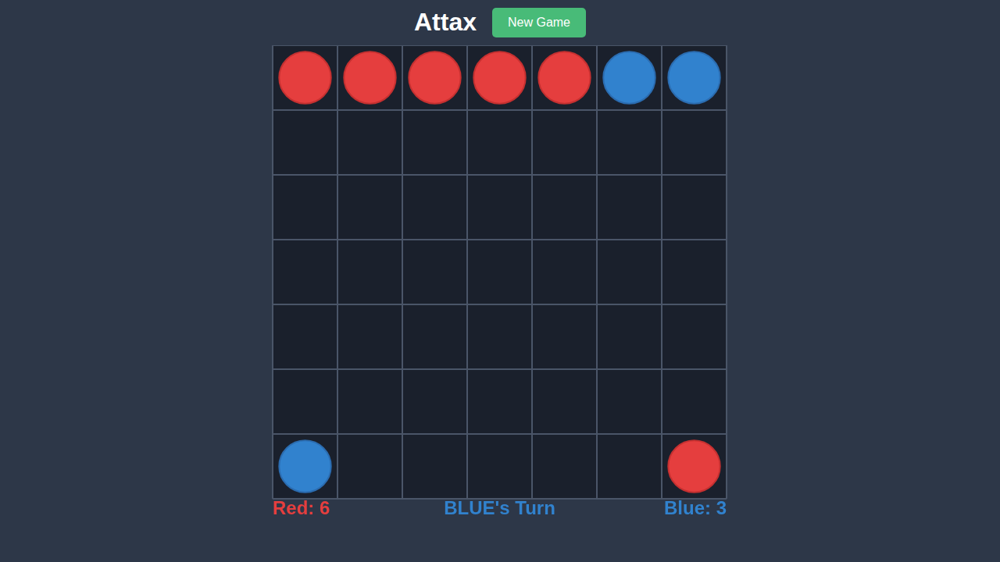

# Test 004: Piece Conversion

## Overview

This test validates the piece conversion mechanics in Attax. When a piece moves to a new location, all adjacent opponent pieces are converted to the moving player's color. This is a core mechanic that makes Attax strategic.

## What This Test Validates

- Adjacent opponent pieces are converted after a move
- Conversions apply to all 8 adjacent cells
- Score updates correctly after conversions
- Both clone and jump moves can trigger conversions

## Test Scenario

This test plays through a sequence of moves where both players advance towards each other along the top row, culminating in a conversion when pieces become adjacent.

1. Red clones from (0,0) to (0,1) - moving towards blue
2. Blue clones from (0,6) to (0,5) - moving towards red
3. Red clones from (0,1) to (0,2) - continuing advance
4. Blue clones from (0,5) to (0,4) - continuing advance
5. Red clones from (0,2) to (0,3) - now adjacent to blue at (0,4)
6. Blue piece at (0,4) is converted to red!

## Significant Moments

### 0000 - Initial State

Starting position before any moves.



**Expected State:**
- Standard starting position
- Red: 2, Blue: 2

### 0001 - Red Selects Piece

Red selects the piece at (0,0) to begin the advance.


**Expected State:**
- Yellow highlight on (0,0)
- Valid moves highlighted in green

### 0002 - After Red Clone

Red has cloned to (0,1).



**Expected State:**
- Red pieces at (0,0) and (0,1)
- Red: 3, Blue: 2
- BLUE's Turn

### 0003 - Blue Selects Piece

Blue selects the piece at (0,6) to counter.



**Expected State:**
- Yellow highlight on (0,6)
- Valid moves highlighted in green

### 0004 - After Blue Clone

Blue has cloned to (0,5).



**Expected State:**
- Blue pieces at (0,6) and (0,5)
- Red: 3, Blue: 3
- RED's Turn

### 0005 - Red Advances

Red continues advancing with another clone.



**Expected State:**
- Red pieces now include (0,2)
- Red: 4, Blue: 3
- BLUE's Turn

### 0006 - Blue Advances

Blue continues advancing.



**Expected State:**
- Blue pieces now include (0,4)
- Red: 4, Blue: 4
- RED's Turn

### 0007 - Conversion Occurs

Red moves to (0,3), which is adjacent to the blue piece at (0,4). The blue piece is converted to red!



**Expected State:**
- Red piece at (0,3) (new)
- Former blue piece at (0,4) is now RED
- Score reflects the conversion: Red gains 2 (new piece + conversion), Blue loses 1
- BLUE's Turn

## Running This Test

```bash
npx playwright test e2e/004-piece-conversion
```

To update screenshots:
```bash
npx playwright test e2e/004-piece-conversion --update-snapshots
```
