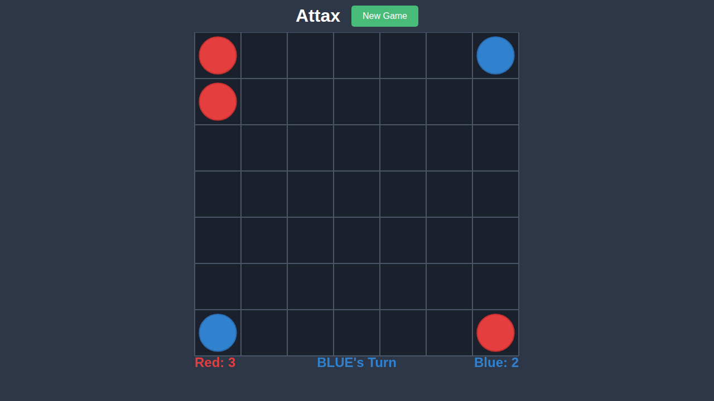

# Test 005: Turn Management

## Overview

This test validates the turn management system in Attax. After each valid move, the turn switches to the opponent player. The UI clearly indicates whose turn it is.

## What This Test Validates

- Red player starts first
- After Red makes a move, turn switches to Blue
- After Blue makes a move, turn switches back to Red
- Turn indicator updates correctly after each move

## Test Scenario

1. Game starts with "RED's Turn"
2. Red makes a clone move from (0,0) to (1,0)
3. Turn switches to "BLUE's Turn"
4. Blue makes a clone move from (0,6) to (0,5)
5. Turn switches back to "RED's Turn"

## Significant Moments

### 0000 - Red Turn at Start

Game begins with Red's turn.


**Expected State:**
- Turn indicator shows "RED's Turn" in red color
- Red player can select and move pieces
- Initial board setup visible

### 0001 - Blue's Turn

After Red makes a move, it's now Blue's turn.



**Expected State:**
- Turn indicator shows "BLUE's Turn" in blue color
- Red piece has been added at (1,0) from the clone move
- Score: Red 3, Blue 2

### 0002 - Red's Turn Again

After Blue makes a move, it's back to Red's turn.


**Expected State:**
- Turn indicator shows "RED's Turn" in red color
- Blue piece has been added at (0,5) from the clone move
- Score: Red 3, Blue 3

## Turn Switching Rules

| Condition | What Happens |
|-----------|--------------|
| Normal move | Turn switches to opponent |
| No valid moves for opponent | Current player goes again |
| Game over | No more turns, winner displayed |

## Running This Test

```bash
npx playwright test e2e/005-turn-management
```

To update screenshots:
```bash
npx playwright test e2e/005-turn-management --update-snapshots
```
