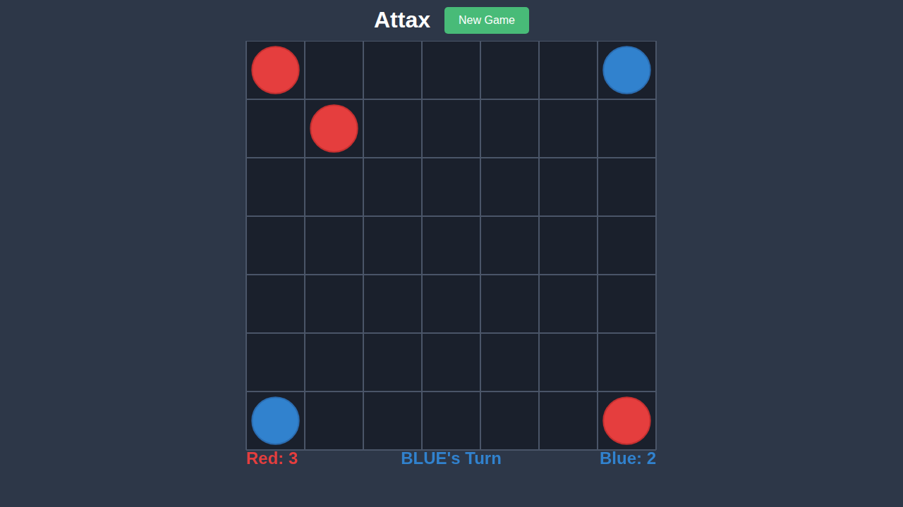
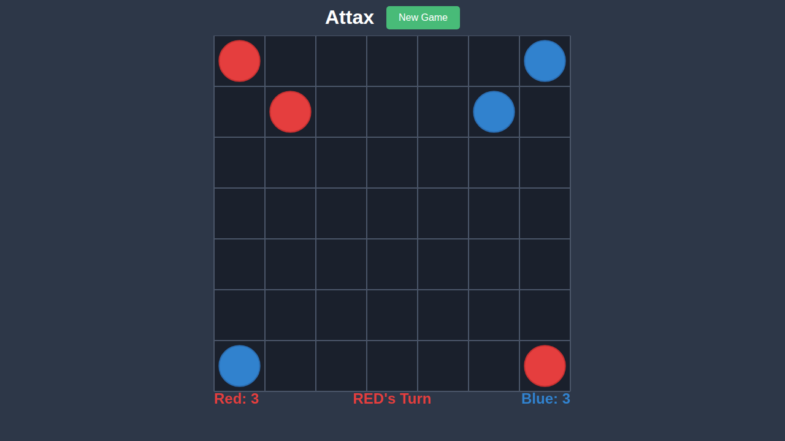
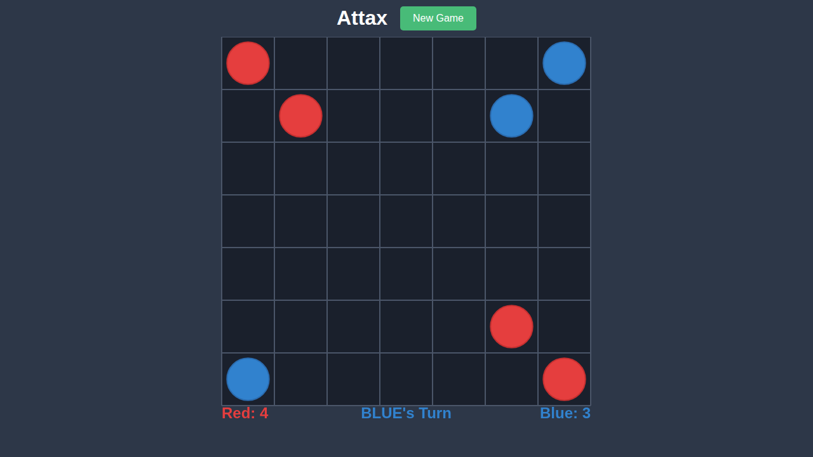
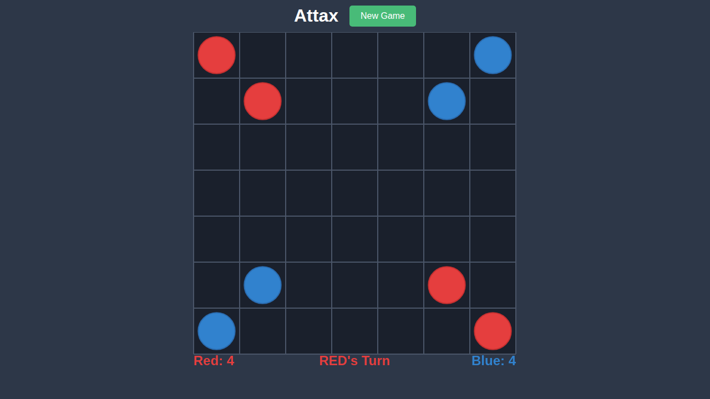
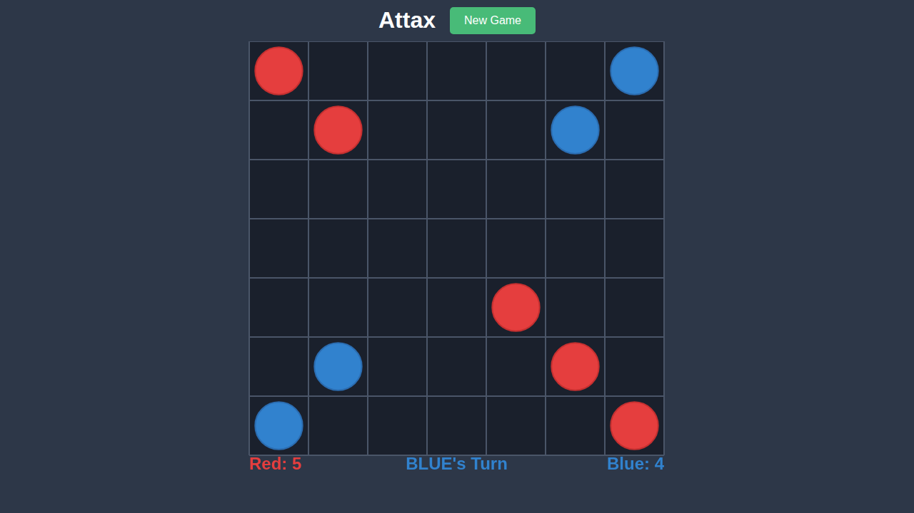
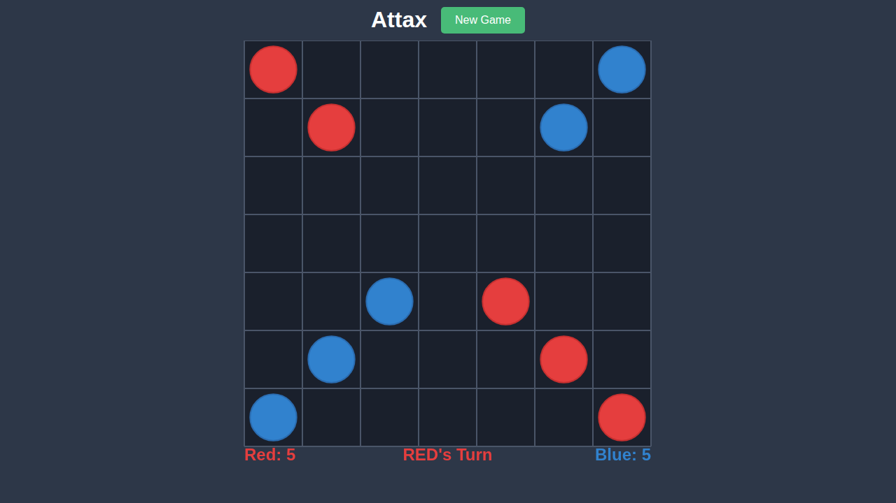
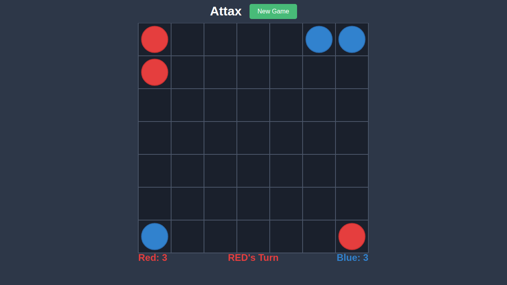

# Test 006: Game Over

## Overview

This test validates game over conditions and the New Game functionality in Attax. The game ends when one player has no pieces left or when neither player can make any moves.

## What This Test Validates

- Game continues as long as both players have pieces and valid moves
- Game progression through multiple turns
- New Game button resets the board to initial state
- After reset, game returns to initial positions and Red's turn

## Test Scenarios

### Scenario 1: Game Progression

This test plays through several turns to demonstrate ongoing gameplay:

1. Red clones from (0,0) to (1,1) - diagonal move
2. Blue clones from (0,6) to (1,5) - diagonal move
3. Red clones from (6,6) to (5,5) - from other corner
4. Blue clones from (6,0) to (5,1) - from other corner
5. More moves continue the game

### Scenario 2: New Game Reset

Tests that the New Game button properly resets the game state.

## Significant Moments

### 0000 - Game Start

Initial game state.


**Expected State:**
- Standard initial board
- Red: 2, Blue: 2
- RED's Turn

### 0001 - Red Move 1

Red clones diagonally to (1,1).



**Expected State:**
- Red piece at (1,1)
- Red: 3, Blue: 2
- BLUE's Turn

### 0002 - Blue Move 1

Blue clones diagonally to (1,5).



**Expected State:**
- Blue piece at (1,5)
- Red: 3, Blue: 3
- RED's Turn

### 0003 - Red Move 2

Red clones from the bottom-right corner.



**Expected State:**
- Red piece at (5,5)
- Red: 4, Blue: 3
- BLUE's Turn

### 0004 - Blue Move 2

Blue clones from the bottom-left corner.



**Expected State:**
- Blue piece at (5,1)
- Red: 4, Blue: 4
- RED's Turn

### 0005 - Red Move 3

Red continues expanding.



**Expected State:**
- Red piece at (4,4)
- Score updated
- BLUE's Turn

### 0006 - Blue Move 3

Blue continues expanding.



**Expected State:**
- Blue piece at (4,2)
- Score updated
- RED's Turn

### 0007 - Before Reset

State of the board after some moves, before clicking New Game.



**Expected State:**
- Board has been altered from initial state
- Multiple pieces on the board
- Scores reflect current game state

### 0008 - After Reset

Board state after clicking New Game button.


**Expected State:**
- Board reset to initial state
- Red: 2, Blue: 2
- RED's Turn
- All pieces back in corner positions

## Game Over Conditions

| Condition | Result |
|-----------|--------|
| One player has 0 pieces | Other player wins |
| Neither player can move | Player with more pieces wins |
| Both can't move, same pieces | Draw |

## Running This Test

```bash
npx playwright test e2e/006-game-over
```

To update screenshots:
```bash
npx playwright test e2e/006-game-over --update-snapshots
```
